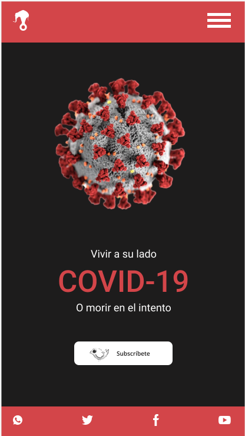

# Minisitio Animal Politico COVID-19

El propósito del sitio radica en mostrar las habilidades en el diseño UI/UX, construcción del sitio usando HTML, CSS , Js Vanila y el deploy respectivo se realizo usando Netlify.

El mockup fue realizado en Adobe XD y se muestra la pantalla principal mobile a continuación.

El sitio es responsive y mobile first. 